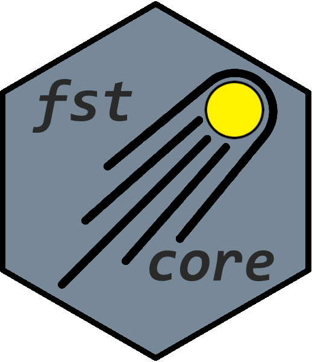

<!-- badges: start -->
  [](https://cran.r-project.org/web/checks/check_results_fstcore.html)
  [](https://cran.r-project.org/package=fstcore)
  [](http://cran.rstudio.com/web/packages/fstcore/index.html)
  [](http://cran.rstudio.com/web/packages/fstcore/index.html)

  [](https://travis-ci.com/fstpackage/fstcore)
  [](https://ci.appveyor.com/project/fstpackage/fstcore)
  [](https://codecov.io/gh/fstpackage/fstcore)
  [](https://github.com/MarcusKlik/fstcore/actions)
<!-- badges: end -->

[](https://opensource.org/licenses/MPL-2.0)


## Overview

R package `fstcore` contains R bindings to the C++ `fstlib` library which allows interfacing with _fst_ files.
It also contains the `LZ4` and `ZSTD` sources used for compression. `fstcore` exists as a package separate from the
`fst` package to facilitate independent updates to the `fstlib`, `LZ4` and `ZSTD` libraries and is used as a
backend to `fst`.


## Installation

Package `fstcore` is automatically installed as a dependency when you install the `fst` package from CRAN.
If you need to install it directly, you can use:

``` r
install.packages("fstcore")
```

You can also use the development version from GitHub:

``` r
# install.packages("devtools")
devtools::install_github("fstpackage/fstcore", ref = "develop")
```

## Basic usage

Please refer to http://www.fstpackage.org/fst to get an introduction to using the `fst` package.


## Contact

Questions, ideas and issues can be reported in the [fst package repository](https://github.com/fstpackage/fst).
